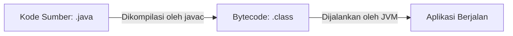

# Memahami Konsep Dasar Algoritma dan Pemrograman menggunakan Bahasa Java

## 1. Apa itu Algoritma?

Sebelum menyentuh kode, kita harus tahu apa itu **Algoritma**. 

> 💡 **Definisi:** Algoritma adalah urutan langkah-langkah logis dan sistematis untuk menyelesaikan suatu masalah atau mencapai tujuan tertentu.

Komputer pada dasarnya hanya menjalankan perintah. Mereka memerlukan instruksi yang sangat spesifik. Jika Anda memberikan instruksi yang salah atau tidak urut, hasilnya pun akan kacau (*Garbage In, Garbage Out*).

### Contoh Algoritma dalam Kehidupan Nyata: Membuat Kopi Instan
1. Ambil cangkir dan sendok.
2. Masukkan bubuk kopi ke dalam cangkir.
3. Rebus air hingga mendidih.
4. **Jika** air sudah mendidih, tuangkan air ke dalam cangkir. **Jika belum**, tunggu 1 menit lalu cek kembali.
5. Aduk hingga rata.
6. Kopi siap dihidangkan.

---

## 2. Mengapa Memilih Java?

Java adalah salah satu bahasa pemrograman paling populer di dunia industri. Keunggulan utamanya adalah slogan **"Write Once, Run Anywhere" (WORA)**. Artinya, sekali Anda menulis kode Java, kode tersebut bisa dijalankan di Windows, Mac, Linux, bahkan di handphone Android tanpa perlu merombak ulang kodenya.

Fitur Utama Java

Mengapa Java begitu populer di kalangan industri dan developer? Berikut adalah karakteristik utamanya:
- Berorientasi Objek (Object-Oriented Programming - OOP): Java memandang semua komponen program sebagai "Objek" yang saling berinteraksi, meniru cara kerja dunia nyata. Ini membuat kode lebih terstruktur, mudah dikelola, dan dapat digunakan kembali.

- Platform Independent: Seperti filosofi WORA, program Java tidak bergantung pada satu sistem operasi tertentu.

- Aman (Secure): Java didesain untuk berjalan di dalam "sandbox" (lingkungan terisolasi) dari JVM, sehingga mencegah program mengakses memori sistem secara ilegal atau membawa virus berbahaya ke komputer host.

- Manajemen Memori Otomatis: Java memiliki fitur Garbage Collector yang otomatis menghapus data di memori yang sudah tidak digunakan, sehingga mencegah kebocoran memori (memory leak).

---

## 3. Struktur Dasar Program Java

Mari kita lihat anatomi dari sebuah program Java yang paling sederhana (*Hello World*):

```java
public class Utama {
    public static void main(String[] args) {
        System.out.println("Halo, Dunia! Saya sedang belajar Java.");
    }
}

```

### Penjelasan Komponen:

* **`public class Utama`**: Di Java, semua kode wajib berada di dalam sebuah *Class*. Nama class (`Utama`) harus sama persis dengan nama file penyimpannya (`Utama.java`).
* **`public static void main(String[] args)`**: Ini adalah *main method*. Anggap ini sebagai **pintu gerbang utama** program. Komputer akan selalu mencari baris ini pertama kali untuk mengeksekusi perintah.
* **`System.out.println(...)`**: Perintah bawaan Java untuk menampilkan tulisan atau teks ke layar/konsol.
* **Tanda Titik Koma (`;`)**: Setiap satu baris instruksi di Java **wajib** diakhiri dengan titik koma.

---

## 4. Konsep Fundamental Pemrograman

Untuk membuat program yang dinamis, Anda wajib menguasai 3 pilar dasar berikut:

### A. Variabel dan Tipe Data

**Variabel** adalah wadah di dalam memori komputer untuk menyimpan data. Karena Java adalah bahasa yang tegas (*strongly typed*), kita harus menentukan **Tipe Data** (jenis benda) apa yang mau dimasukkan ke dalam wadah tersebut.

| Tipe Data | Kegunaan | Contoh Nilai | Contoh Kode Java |
| --- | --- | --- | --- |
| `int` | Angka bulat | `25`, `-10`, `1000` | `int umur = 20;` |
| `double` | Angka pecahan/desimal | `3.14`, `75.5` | `double tinggi = 170.5;` |
| `char` | Satu karakter saja | `'A'`, `'9'`, `'$'` | `char nilaiHuruf = 'A';` |
| `String` | Teks/Kumpulan karakter | `"Budi"`, `"Jakarta"` | `String nama = "Budi";` |
| `boolean` | Logika Benar/Salah | `true` atau `false` | `boolean isLulus = true;` |

### B. Percabangan (Struktur Kondisional)

Algoritma membutuhkan kemampuan untuk mengambil keputusan berdasarkan kondisi tertentu menggunakan perintah `if`, `else if`, dan `else`.

```java
int nilaiUjian = 80;

if (nilaiUjian >= 75) {
    System.out.println("Selamat, Anda Lulus!");
} else {
    System.out.println("Maaf, Anda harus remidi.");
}

```

### C. Perulangan (Looping)

Komputer sangat hebat dalam melakukan hal yang sama berulang-ulang. Di Java, kita bisa menggunakan perulangan `for` atau `while`.

*Contoh mencetak angka 1 sampai 5:*

```java
for (int i = 1; i <= 5; i++) {
    System.out.println("Angka ke- " + i);
}

```

> 🔄 *Cara kerja:* Mulai dari `i = 1`, selama `i` kurang dari atau sama dengan 5, cetak angkanya, lalu naikkan nilai `i` sebesar 1 (`i++`).

---

## 5. Alur Kerja Eksekusi Java



1. **Menulis Kode**: Menulis kode di teks editor (VS Code, Notepad) atau IDE (IntelliJ IDEA, NetBeans) lalu disimpan dengan ekstensi `.java`.
2. **Kompilasi (Compile)**: Kode diubah oleh *Java Compiler* (`javac`) menjadi *Bytecode* (file `.class`) agar bisa dipahami mesin Java.
3. **Eksekusi (Run)**: *Java Virtual Machine* (JVM) menjalankan *bytecode* tersebut hingga tampil di layar Anda.

---

## 📌 Rangkuman Penting

* Java bersifat **Case-Sensitive** (artinya variabel `nama`, `Nama`, dan `NAMA` dianggap berbeda).
* Selalu perhatikan pasangan kurung kurawal `{}` untuk membuka dan menutup blok kode.
* Jangan lupakan titik koma `;` di akhir pernyataan jika tidak ingin terkena *Compile Error*.
